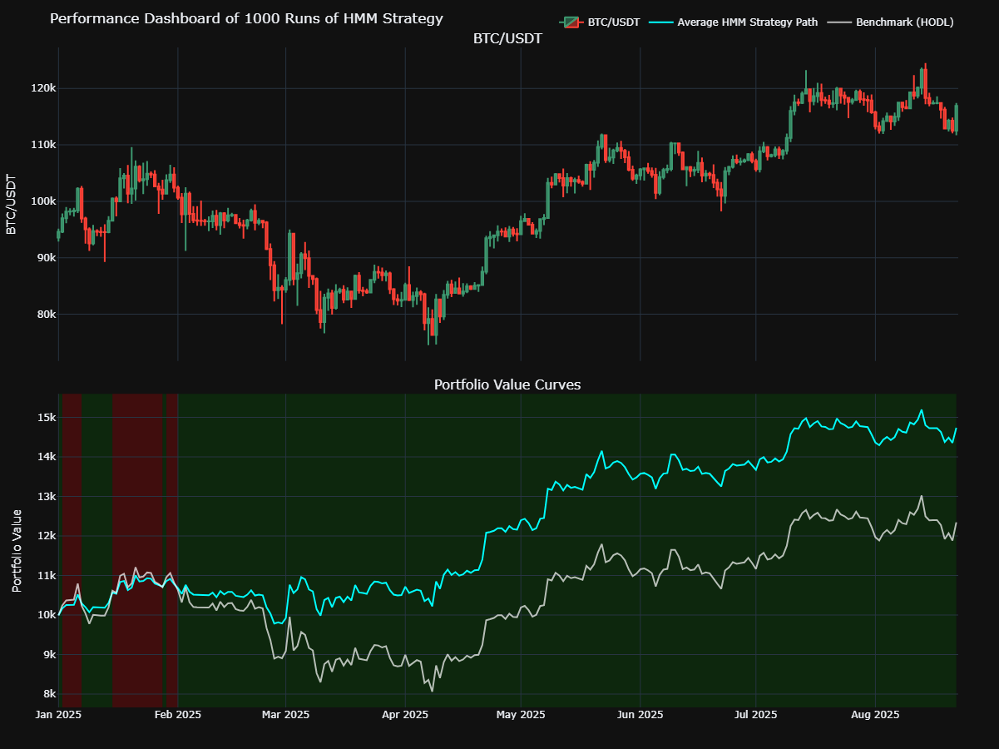

# HMM Bitcoin Trading Model

An algorithmic trading model that uses a Hidden Markov Model (HMM) to identify latent market regimes in Bitcoin (BTC) price data and make strategic trading decisions.

This project fetches historical BTC/USDT data, engineers relevant financial features, and trains an HMM to uncover underlying market states (e.g., high-volatility bull market, low-volatility bear market, sideways movement). Based on the predicted state, it executes a trading strategy and backtests its performance against a simple "Buy and Hold" (HODL) baseline.

## Performance Dashboard

The output is an interactive dashboard that visualizes the strategy's performance, allowing for in-depth analysis of its behavior over time.



### Key Features

- **Market Regime Detection:** Utilizes a Gaussian Hidden Markov Model to classify market behavior into distinct, latent states.
- **Dynamic Strategy:** Allocates positions (Long/Short/Neutral) based on the predicted market regime.
- **Comprehensive Backtesting:** Includes a backtesting engine that accounts for transaction costs (commission and slippage).
- **Benchmark Comparison:** Directly compares the HMM strategy's performance against a HODL baseline.
- **Interactive Visualization:** Generates a rich, interactive dashboard with Plotly, featuring:
  - Candlestick price data.
  - Log-scale equity curves for both the HMM strategy and HODL.
  - Shaded regions indicating periods of outperformance or underperformance.
- **Configurable Parameters:** Easily tune model and backtesting parameters in a central configuration file.

## How It Works

The model operates through a sequential pipeline:

1. **Data Loading:** Fetches historical BTC/USD data using `yfinance`.
2. **Feature Engineering:** Calculates key indicators like returns and volatility, which are used as inputs for the HMM.
3. **HMM Training:** Trains a GaussianHMM from `scikit-learn` on the engineered features to learn the market states.
4. **Signal Generation:** Predicts the current market state for each day and generates a trading signal (1 for Long, -1 for Short, 0 for Neutral).
5. **Backtesting:** Simulates the execution of the trading signals, calculates returns, and builds the equity curves.
6. **Visualization:** Plots the final results and metrics in the interactive dashboard.

## Getting Started

Follow these instructions to set up and run the project locally.

### Prerequisites

- Python 3.8+
- Pip and a virtual environment tool (`venv`)

### Installation

1. **Clone the repository:**

    ```sh
    git clone https://github.com/your-username/hmm-btc-trading-model.git
    cd hmm-btc-trading-model
    ```

2. **Create and activate a virtual environment:**

    ```sh
    python -m venv venv
    # On Windows
    .\venv\Scripts\activate
    # On macOS/Linux
    source venv/bin/activate
    ```

3. **Install the required dependencies:**

    ```sh
    pip install -r requirements.txt
    ```

### Usage

The primary way to run a full analysis is by using the Jupyter Notebook.

1. **Launch Jupyter Notebook:**

    ```sh
    jupyter notebook
    ```

2. **Open and run `main.ipynb`:**
    Open the `main.ipynb` file in your browser and run the cells sequentially. The notebook walks through the entire process from data loading to visualization.

## License

Distributed under the MIT License. See `LICENSE` for more information.

## Connect with Me

Thank you for visiting my GitHub profile! Feel free to reach out if you have any questions or opportunities to collaborate. Let's connect and explore new possibilities together:

[](https://github.com/Yosri-Ben-Halima)
[](https://www.linkedin.com/in/yosri-ben-halima-3553a9221/)
[](https://www.facebook.com/NottherealYxsry)
[](https://www.instagram.com/yosrybh/)
[](mailto:yosri.benhalima@ept.ucar.tn)
[](https://personal-web-page-yosribenhlima.streamlit.app/)
[](https://drive.google.com/file/d/18xB1tlZUBWz5URSli_9kewEFZwZPz235/view?usp=sharing)
[](https://pypi.org/user/yosri-ben-halima/)
